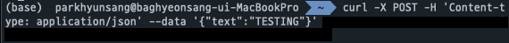
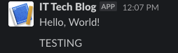
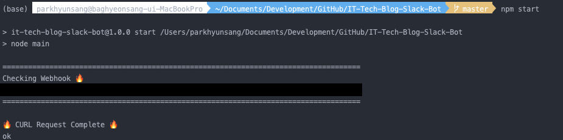

# IT Tech Blog Slack Bot 
IT 회사들의 Tech Blog에 새로운 글이 올라올 때마다 알림을 주는 슬랙 봇입니다.

```javascript
const request = require('request');
```

```shell script
npm install request-to-curl --save
```



슬랙의 웹훅은 CURL를 통한 요청을 합니다.  

```shell script
curl -X POST -H 'Content-type: application/json' --data '{"text":"Hello, World!"}' https://hooks.slack.com/services/~~
```



[https://curl.trillworks.com/#node](https://curl.trillworks.com/#node) 를 통한 Curl 요청을 Ndoe.js 코드로 변환 시켜 줍니다.  

